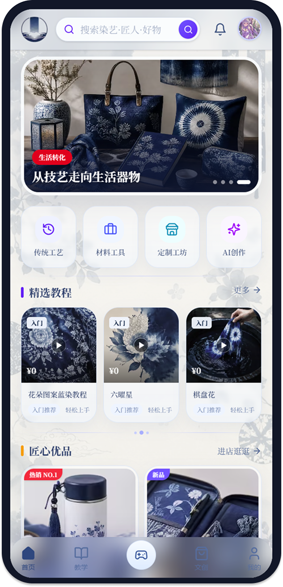
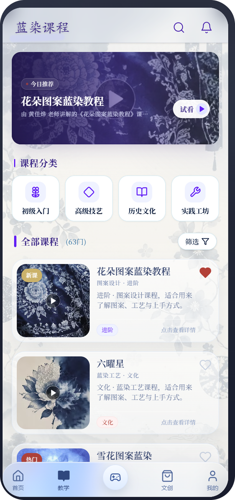
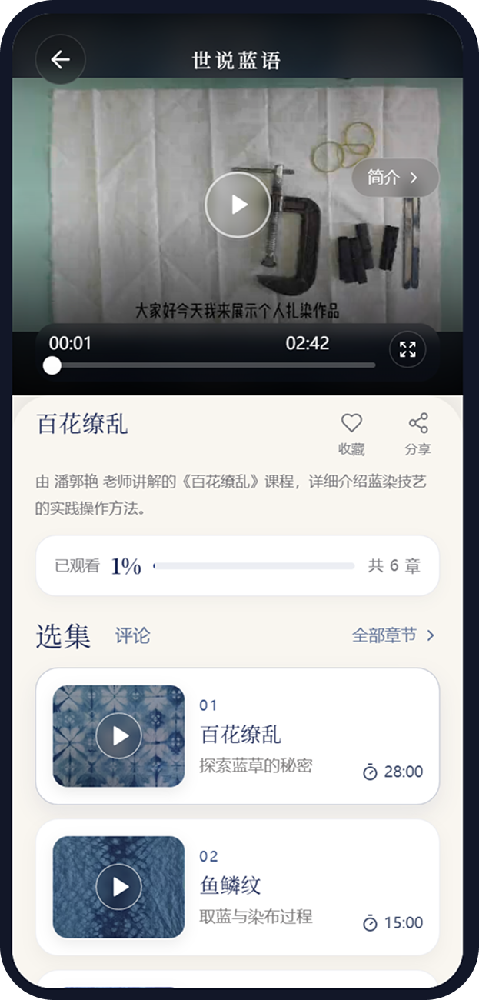
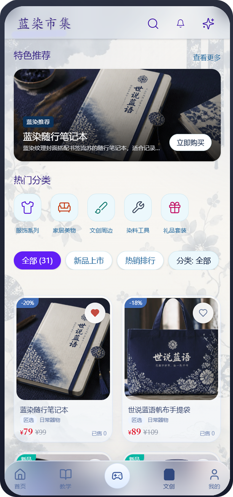
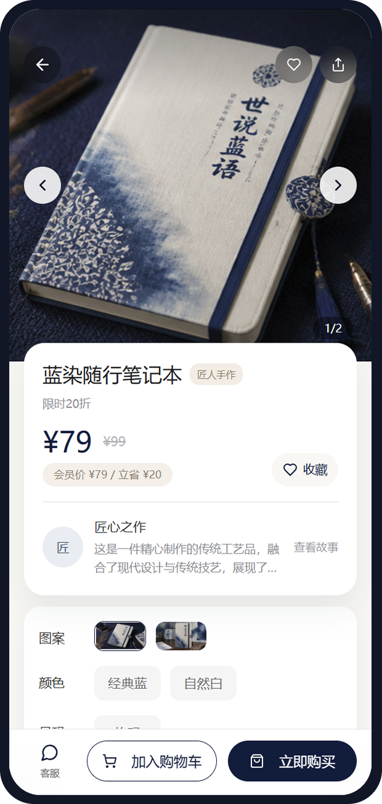
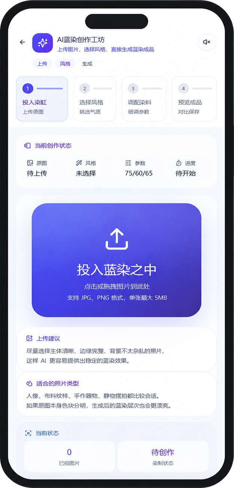
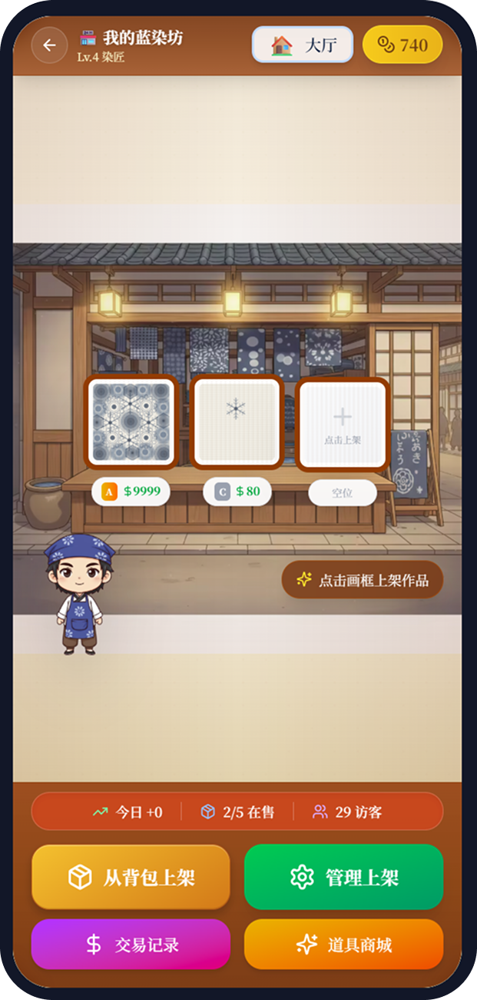
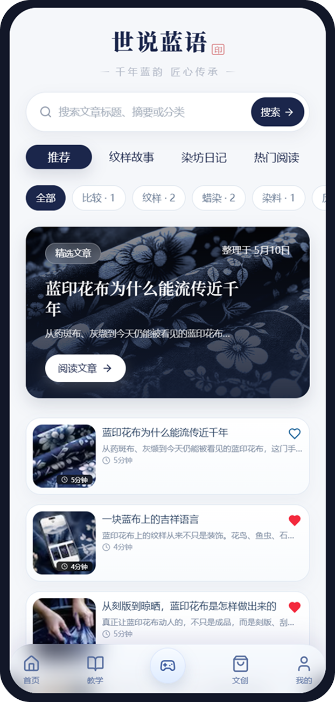
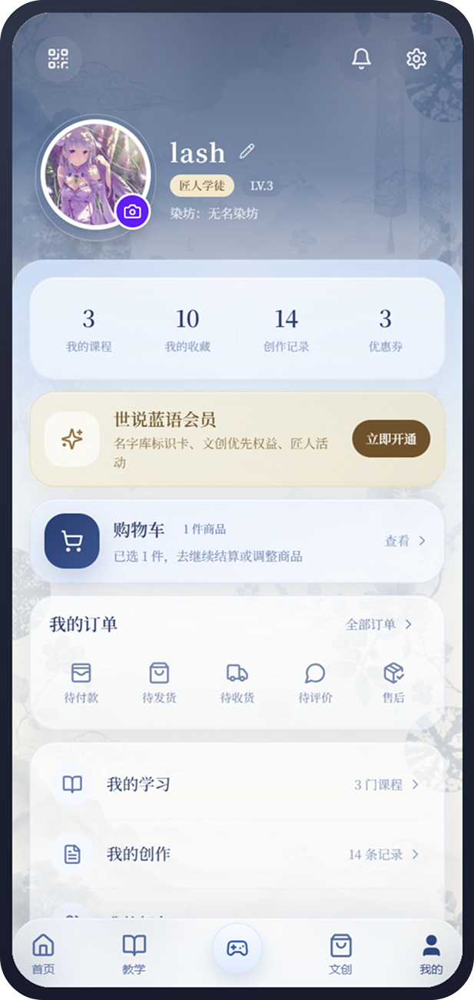

# 世说蓝语｜蓝染文化传承平台

世说蓝语是一个围绕蓝染文化传承、教学体验、文创展示与互动创作构建的移动端优先 Web App。项目尝试把传统蓝染工艺的内容传播、课程学习、文创消费和数字化体验整合到同一个产品闭环中，让用户可以从“了解文化”自然进入“学习工艺”“浏览作品”“参与创作”的完整路径。

## 项目定位

本项目是个人毕业设计作品，核心目标是用现代 Web 技术重新组织蓝染文化的线上体验。它不是单纯的展示页，而是一个包含内容、课程、商城、AI 创作、游戏化工坊、用户系统和后台管理能力的综合应用原型。

## 功能亮点

- 首页与欢迎体验：沉浸式进入、内容轮播、快捷入口、精选课程、文创商品和文化文章聚合展示。
- 教学课程：课程列表、课程详情、视频学习、课程收藏与学习入口。
- 文创商城：商品浏览、商品详情、购买流程、收藏与购物车相关交互。
- 文化内容：蓝染文化文章、图文阅读、传统工艺知识传播。
- AI 创作：围绕蓝染纹样生成的创作流程，包含上传、风格选择、参数调整、生成预览等交互。
- 游戏化工坊：以蓝染制作和作品经营为主题的互动模块，增强文化体验的参与感。
- 用户中心：个人资料、收藏、消息通知等基础用户功能。
- 后台与数据：基于 Supabase 的数据表结构、认证、存储和 API 聚合能力。

## 界面预览

| 首页 | 教学课程 | 视频学习 |
| --- | --- | --- |
|  |  |  |

| 文创商城 | 商品详情 | AI 创作 |
| --- | --- | --- |
|  |  |  |

| 游戏工坊 | 文化文章 | 用户中心 |
| --- | --- | --- |
|  |  |  |

## 技术栈

- Framework: Next.js 14 App Router
- Language: TypeScript
- UI: React 18, Tailwind CSS, Radix UI, Lucide React
- State and data: React Context, Zustand, SWR
- Backend: Next.js API Routes, Supabase PostgreSQL, Supabase Auth, Supabase Storage
- Motion and interaction: Framer Motion, Embla Carousel
- Validation and forms: Zod, React Hook Form
- Tests: Vitest, Playwright

## 项目结构

```text
app/          Next.js 页面与 API 路由
components/   页面组件、通用 UI、导航、游戏和后台组件
contexts/     全局上下文与认证状态
hooks/        自定义 Hooks
lib/          Supabase、数据请求、工具函数与业务服务
public/       静态资源、品牌图、页面截图与展示素材
scripts/      环境检查与初始化脚本
supabase/     数据库结构、迁移和存储桶配置
types/        TypeScript 类型定义
```

## 本地运行

```bash
npm install
npm run dev
```

访问：

```text
http://localhost:3000
```

如需连接自己的 Supabase 项目，请在本地创建 `.env.local`，填入对应环境变量：

```bash
NEXT_PUBLIC_SUPABASE_URL=
NEXT_PUBLIC_SUPABASE_ANON_KEY=
SUPABASE_SERVICE_KEY=
SUPABASE_PRODUCT_BUCKET=product-media
AI6800_API_KEY=
```

> 仓库不会包含真实环境变量、后台账号、私有密钥或线上业务数据。公开源码只保留项目结构、界面实现和数据库结构参考。

## 常用命令

```bash
npm run dev
npm run build
npm run lint
npm run test
npm run test:e2e
```

## 数据库说明

`supabase/` 目录保留了项目使用到的主要表结构、迁移脚本和存储桶配置，可用于理解数据模型和本地复现。实际运行时需要自行创建 Supabase 项目并配置环境变量。

主要数据模块包括：

- 用户资料与认证
- 课程与视频学习
- 文创商品与商品媒体
- 购物车、收藏、订单相关数据
- 文化文章、评论与点赞
- 游戏工坊、道具、背包、市场交易
- 好友、消息与通知

## 个人工作内容

- 完成项目的信息架构、移动端界面设计与主要交互流程。
- 使用 Next.js App Router 组织页面、API 与服务端数据聚合。
- 设计首页、课程、商城、AI 创作、游戏工坊、用户中心等核心模块。
- 接入 Supabase 作为认证、数据库和媒体存储基础。
- 整理数据库结构、前端组件体系和展示用静态资源。
- 针对移动端浏览体验进行界面适配与性能优化。

## 项目状态

当前版本为作品集展示版，重点展示最终产品形态、源码结构和主要技术实现。部分依赖真实后端数据或第三方服务的功能，需要配置对应 Supabase 与 AI 服务环境变量后才能完整运行。
